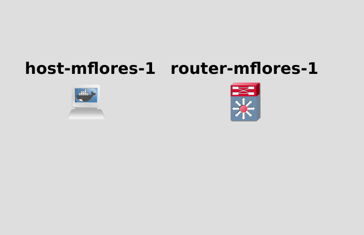
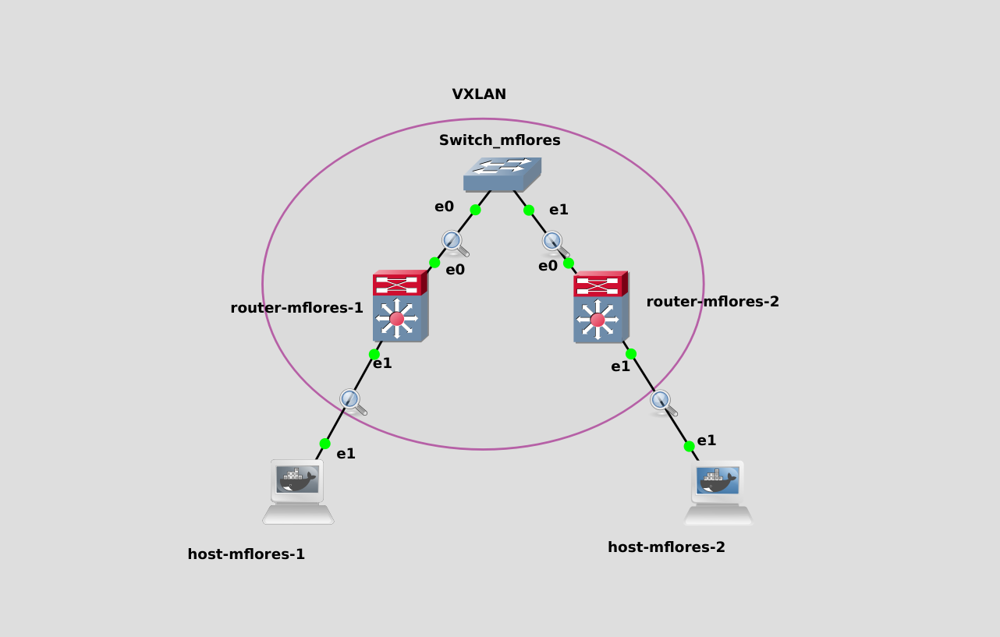
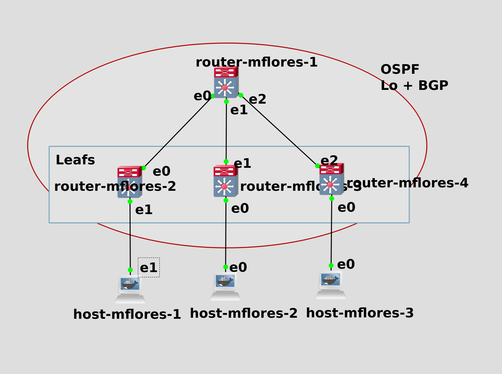

# Bgp At Doors of Autonomous Systems is Simple

Simulation of virtual network solutions with GNS3 inside a virtual machine.

# Usage
#### VIRTUAL MACHINE
Launch the VM and ssh into it with X11 forwarding

``` 
vagrant up
vagrant ssh -- -X
```
### Network simulations
#### Requirements
For any of the network simulations, launching /vagrant/p1/build_devices beforehand is mandatory.

# Part 1
[](Topology1)\
Configuring GNS3 and Docker to create a Host and a Router from docker images.\
[DOCUMENTATION](Doc/p2.md)

# Part 2
[](Topology2)\
VXLAN Network topology with 2 hosts, 2 routers and one switch.\
[DOCUMENTATION](Doc/p2.md)

# Part 3
[](Topology3)

BGP EVPN (Ethernet VPN) over VXLAN setup with:
- one router acting as a RR (route reflector)
- three routers for VXLAN (VTEPs-VXLAN tunnel endpoints)
- three hosts connected to the routers 

[DOCUMENTATION](Doc/p3.md)


